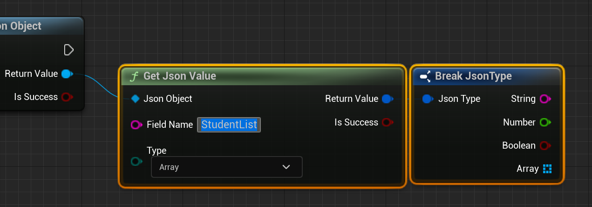

# JSON Data Brother

LANGUAGE: English, [简体中文](README_zh.md)


- [JSON Data Brother](#json-data-brother)
	- [INTRODUCE](#introduce)
	- [SUMMARY](#summary)
	- [JSON HANDLER](#json-handler)
	- [JSON SENDER](#json-sender)
	- [How does my PHP return data?](#how-does-my-php-return-data)  
			- [First, Create a blank php like this.](#first-create-a-blank-php-like-this)
			- [Second, Type the php code like this](#second-type-the-php-code-like-this)
			- [Third, Open your browser and open php page](#third-open-your-browser-and-open-php-page)
			- [So, if we write this php in a more complex way...](#so-if-we-write-this-php-in-a-more-complex-way)
	- [How to check my php return data in BP?](#how-to-check-my-php-return-data-in-bp)
			- [First, Add a JsonSender ActorComponent to your Actor](#first-add-a-jsonsender-actorcomponent-to-your-actor)
			- [Second, Create node like this](#second-create-node-like-this)
			- [Third, Create a CustomEvent for the red "Event"](#third-create-a-customevent-for-the-red-event)
			- [Fourth, Print the content](#fourth-print-the-content)
			- [Fifth, Send JSON String to your php](#fifth-send-json-string-to-your-php)
			- [Sixth, Place actor to your level](#sixth-place-actor-to-your-level)
			- [Final, Play or Simulate](#final-play-or-simulate)
	- [How to get Field Value？](#how-to-get-field-value)
			- [First, deserialize your JSON String into JSON Object](#first-deserialize-your-json-string-into-json-object)
			- [Second, use GetJsonValue node to get the value in the JSON Object](#second-use-getjsonvalue-node-to-get-the-value-in-the-json-object)
			- [Third, use Break node to obtain the data in the structure](#third-use-break-node-to-obtain-the-data-in-the-structure)
			- [Fourth, Print String](#fourth-print-string)
			- [Final, Play or Simulate.](#final-play-or-simulate-1)
	- [How to modify the Value of a Field?](#how-to-modify-the-value-of-a-field)
			- [First, deserialize your JSON String into JSON Object.](#first-deserialize-your-json-string-into-json-object-1)
			- [Second, create a SetJsonValue node and set it correctly](#second-create-a-setjsonvalue-node-and-set-it-correctly)
			- [Third, create a structure for ValueStruct](#third-create-a-structure-for-valuestruct)
			- [Fourth, enter a new value in the structure](#fourth-enter-a-new-value-in-the-structure)
			- [Fifth, add a GetJsonValue node after the SetJsonValue node](#fifth-add-a-getjsonvalue-node-after-the-setjsonvalue-node)
			- [Sixth, create the structure and Print the String in the structure as before](#sixth-create-the-structure-and-print-the-string-in-the-structure-as-before)
			- [Final, Play or Simulate](#final-play-or-simulate-2)
	- [How to modify the Value of Field in an array element?](#how-to-modify-the-value-of-field-in-an-array-element)
			- [First, write a complex JSON String](#first-write-a-complex-json-string)
			- [Second, get the Field of the array element and break the structure](#second-get-the-field-of-the-array-element-and-break-the-structure)
			- [Third, get JSON Object in the array](#third-get-json-object-in-the-array)
			- [Fourth, set the Value of Name Field to Lisa](#fourth-set-the-value-of-name-field-to-lisa)
			- [Fifth, output the value of the Name Field in the first JsonObject in the StudentList array](#fifth-output-the-value-of-the-name-field-in-the-first-jsonobject-in-the-studentlist-array)
			- [Sixth, connect JsonObject with the original JsonObject](#sixth-connect-jsonobject-with-the-original-jsonobject)
			- [Final, Play or Simulate](#final-play-or-simulate-3)


## INTRODUCE

This plug-in can easily process JSON data and message them back to your server.

> I have no work experience but I know I can use php **ECHO** to return the data I want. 
>
> For example, you need a function to query user data and this function can be run on UNITY or UNREAL ENGINE. You may search for SQL plug-ins in UNITY MARKET or EPIC MARKET, but it will be very troublesome. (You need twice as much work)
>
> If we implement this function on PHP and then use the HTTP REQUEST function of UNITY or UNREAL ENGINE to query the SQL data, this will become very simple.
>
> 


## SUMMARY

This plug-in has two parts: **Json Handler** and **Json Sender**. Their names are the same as their functions.

| Name         | Function                                                     |
| :----------- | ------------------------------------------------------------ |
| Json Handler | *Serialize* your JsonObject or *deserialize* your JsonString. <br />You can modify the value of the field after deserialization or just read their values. <br /> |
| Json Sender  | Message json data to your php and receive data returned by php echo.<br /> |


## JSON HANDLER

I don't want this plugin to be toooo complex, so I only gave it simple **GET** and **SET** functions, which is enough to complete my stupid workflow. 

**Note that you cannot directly replace an array object with other array object**


## JSON SENDER

Because of some limitations of UE C++, this function *(JsonSender)* cannot be separated from an object, so I made it into a **component**, which will work well in my cute Actor. 

This node will create a HTTP REQUEST **POST** which MIME type is set to **Application/json; Charset="UTF8"** . When the web is loaded, the **OnRequestCompletee** delegate will be broadcast.


------


## How does my PHP return data?

#### First, Create a blank php like this.

 


#### Second, Type the php code like this

```php
<?php 
echo "Shader makes me full of power!";
?>
```


#### Third, Open your browser and open php page

As you can see, only your **ECHO CONTENT** on the whole page. 

This is the **result** that the website will return to our program. (CallbackDelegate->Content)

 


#### So, if we write this php in a more complex way...

```php
<?php
	if($mode == "query")
	{
		$username = YOUR QUERY CODE;
		echo $username;
	}

	if($mode == "delete")
	{
		YOUR DELETE CODE;
		echo "Successful";
	}

	if($mode == "add")
	{
		YOUR ADD CODE;
		echo "Successful";
	}
?>
```

Can you imagine that your work has been transferred to PHP!

**You are no longer limited by SQL plug-ins.**

**No matter what program you are developing, As long as your platform can message HTTP REQUEST, it can connect with your php system!**


------


## How to check my php return data in BP?

#### First, Add a JsonSender ActorComponent to your Actor

 


#### Second, Create node like this

This will bind the function for the delegate OnRequestCompletee.

 


#### Third, Create a CustomEvent for the red "Event"

 


And you will see this node, **Content** variable is your php return data.

 


#### Fourth, Print the content

 

​	

#### Fifth, Send JSON String to your php

My php will return the value of the mode field. You can find the PHP code below.

 

```php
<?php
	header("content-type:text/html;charset=utf-8");
	$jsonString = file_get_contents("php://input");
	$jsonObject = json_decode($jsonString);
	echo $jsonObject->mode;
?>
```


#### Sixth, Place actor to your level

 


#### Final, Play or Simulate

 


------


## How to get Field Value？

#### First, deserialize your JSON String into JSON Object

You can put the basic format of JSON String on your PHP server to dynamically update them.

 


#### Second, use GetJsonValue node to get the value in the JSON Object

This will return a structure to get the type pointed by the **Type** enumeration.

 


#### Third, use Break node to obtain the data in the structure

 


And you will get such a structure.

 


The data on the structure corresponds **one-to-one** with the type of the GetJsonValue node.

 


#### Fourth, Print String

 


Blueprint overview.

 


#### Final, Play or Simulate.

As you can see, the value of mode is printed.

 


------


## How to modify the Value of a Field?

#### First, deserialize your JSON String into JSON Object.

 


#### Second, create a SetJsonValue node and set it correctly

The **FieldType** variable is the type of this Field. If the type is wrong, it will LOG ERROR.

 


#### Third, create a structure for ValueStruct

 

 


The data in the structure is **one-to-one** corresponding to **FieldType**.

**Set array value to other array object is not allowed.**

 


#### Fourth, enter a new value in the structure

 


#### Fifth, add a GetJsonValue node after the SetJsonValue node

 


#### Sixth, create the structure and Print the String in the structure as before

 


#### Final, Play or Simulate

**TESTTTT**  has been modified to **You are clear**.

 


------


## How to modify the Value of Field in an array element?

#### First, write a complex JSON String

This JSON has a **StudentList** array and two elements.

***Each element can be regarded as a JSON Object***.

I like to use the **Make Literal String** node to organize complex string data.

 

```json
{
 "StudentList":
 [
   {
    "Name":"Bob",
    "Age":"18"
   },
   {
    "Name":"Billy",
    "Age":"19"
   }
 ]
}
```


#### Second, get the Field of the array element and break the structure

 


#### Third, get JSON Object in the array

 


#### Fourth, set the Value of Name Field to Lisa

 

 So far, we have successfully changed Bob to Lisa. Next we will print this Name Value.


#### Fifth, output the value of the Name Field in the first JsonObject in the StudentList array

 


#### Sixth, connect JsonObject with the original JsonObject

The return value of the SetJsonValue node is an element of the array, so we need to connect the JsonObject to the original JsonObject Root.


#### Final, Play or Simulate

As you can see, Bob in JsonObject has been changed to Lisa.

 