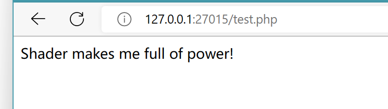
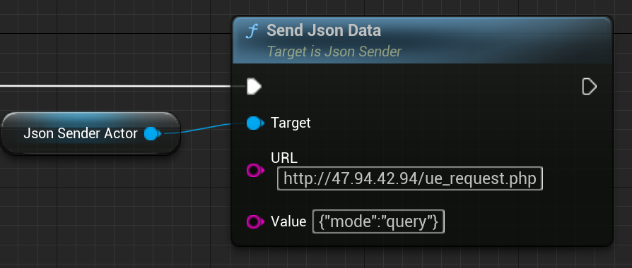

# JSON Data Brother

LANGUAGE: [English](README.md), 简体中文

[TOC]

## 介绍

这个插件可以简单地处理 JSON 数据并将其发送给你的 PHP。

> 我没有工作经验，但我知道我可以用 PHP 的 **ECHO** 返回我想要的数据。 
>
> 举个例子，你需要在 UNITY 和 UE 上做一个查询用户数据的功能。你可能会在 UNITY 或 UE 的商城搜索 SQL 插件，但这肯定会很麻烦。(因为插件不同，两个平台需要做两次 SQL 内容)
>
> 如果我们在 PHP 上实现这个功能并且使用 UNITY 和 UE 的 HTTP REQUEST 功能去返回 SQL 的数据，那么这件事情就会变得非常简单了：你只需要在 PHP 上实现一次 SQL 功能。
>
> 


## 总结

这个插件有两个部分： **Json Handler** 和 **Json Sender**，它们的功能正如它们名字那样。

| Name         | Function                                                     |
| :----------- | ------------------------------------------------------------ |
| Json Handler | *序列化* 你的 JsonObject 或 *反序列化* 你的 JsonString。 <br />在反序列化之后，你就可以修改 Field 的值或仅仅是获取这些值。<br /> |
| Json Sender  | 发送 JSON 数据到你的 php 服务器并返回 php 的数据。<br />     |


## JSON HANDLER

我不想让这个插件变得特别复杂，所以我只做了 **GET** 和 **SET** 两种功能，这些功能足够满足我上面的愚蠢工作流了。 

**注意，你不能用数组对象去赋值其他的数组对象**


## JSON SENDER

因为 UE C++ 的一些限制，JsonSender 的功能不能完全脱离对象独立存在。所以我就把 JsonSender 做成一个 Actor 组件了。

这个节点会创建并发送 **POST** 类型的 HTTP Request，这个 Request 的 MIME 类型是 **Application/json; Charset="UTF8"**，当 URL 网站加载完毕了，**OnRequestCompletee** 这个委托就会被广播。


------


## 如何让我的 PHP 返回数据？

#### 第一，像这样创建一个空白的 php 文件

 


#### 第二，像这样输入 php 代码

```php
<?php 
echo "Shader makes me full of power!";
?>
```


#### 第三，启动浏览器并打开你的 php 页面

如你所见，整个页面上只有你 **ECHO** 出来的内容。

这就是网站会给程序返回的结果。(CallbackDelegate->Content)

 


#### 所以，如果我们用更复杂的方式写这个 php ...

```php
<?php
	if($mode == "query")
	{
		$username = YOUR QUERY CODE;
		echo $username;
	}

	if($mode == "delete")
	{
		YOUR DELETE CODE;
		echo "Successful";
	}

	if($mode == "add")
	{
		YOUR ADD CODE;
		echo "Successful";
	}
?>
```

你可以想象到吗，你的工作转移到了 PHP 上！

**你不再受到 SQL 插件的限制。**

**无论你开发的是什么软件，只要这个软件能够发送 HTTP REQUEST，那么你就能使用你的 PHP 系统！**


------


## 如何在蓝图中查看 PHP 返回的数据？

#### 首先，为你的 Actor 添加一个 JsonSender 组件

 


#### 第二，像这样连接节点

这会为委托 OnRequestCompletee 绑定函数。

 


#### 第三，为红色的 "Event" 创建一个自定义事件

 


创建好后，你就可以看到这个节点了， **Content** 变量就是你 PHP 返回的数据。

 


#### 第四，输出 Content

 

​	

#### 第五，向你的 PHP 发送 JSON 数据

我的 php 会返回 mode 这个 Field 的值，你可以在下方找到这个 PHP 代码。

 

```php
<?php
	header("content-type:text/html;charset=utf-8");
	$jsonString = file_get_contents("php://input");
	$jsonObject = json_decode($jsonString);
	echo $jsonObject->mode;
?>
```


#### 第六，把这个 Actor 摆放到关卡里

 


#### 运行查看结果

 