# JSON Data Brother

LANGUAGE: [English](README.md), 简体中文


- [JSON Data Brother](#json-data-brother)
	- [介绍](#介绍)
	- [总结](#总结)
	- [JSON HANDLER](#json-handler)
	- [JSON SENDER](#json-sender)
	- [如何让我的 PHP 返回数据？](#如何让我的-php-返回数据)
			- [第一，像这样创建一个空白的 php 文件](#第一像这样创建一个空白的-php-文件)
			- [第二，像这样输入 php 代码](#第二像这样输入-php-代码)
			- [第三，启动浏览器并打开你的 php 页面](#第三启动浏览器并打开你的-php-页面)
			- [所以，如果我们用更复杂的方式写这个 php ...](#所以如果我们用更复杂的方式写这个-php-)
	- [如何在蓝图中查看 PHP 返回的数据？](#如何在蓝图中查看-php-返回的数据)
			- [首先，为你的 Actor 添加一个 JsonSender 组件](#首先为你的-actor-添加一个-jsonsender-组件)
			- [第二，像这样连接节点](#第二像这样连接节点)
			- [第三，为红色的 "Event" 创建一个自定义事件](#第三为红色的-event-创建一个自定义事件)
			- [第四，输出 Content](#第四输出-content)
			- [第五，向你的 PHP 发送 JSON 数据](#第五向你的-php-发送-json-数据)
			- [第六，把这个 Actor 摆放到关卡里](#第六把这个-actor-摆放到关卡里)
			- [运行查看结果](#运行查看结果)
	- [如何获取 JSON Field 的 Value？](#如何获取-json-field-的-value)
			- [第一，将你的 JSON String 反序列化成 JSON Object](#第一将你的-json-string-反序列化成-json-object)
			- [第二，使用 Get Json Value 节点以获取 JSON Object 中的数据](#第二使用-get-json-value-节点以获取-json-object-中的数据)
			- [第三，使用 Break 节点获取结构体中的数据](#第三使用-break-节点获取结构体中的数据)
			- [第四，将 String 打印出来](#第四将-string-打印出来)
			- [最终，开始游戏](#最终开始游戏)
	- [如何修改 JSON Field 的 Value？](#如何修改-json-field-的-value)
			- [第一，将你的 JSON String 反序列化成 JSON Object。](#第一将你的-json-string-反序列化成-json-object-1)
			- [第二，创建 Set Json Value 节点并正确设置](#第二创建-set-json-value-节点并正确设置)
			- [第三，为 ValueStruct 创建结构体](#第三为-valuestruct-创建结构体)
			- [第四，在结构体中输入新的 Value](#第四在结构体中输入新的-value)
			- [第五，在 SetJsonValue 节点后面添加一个 GetJsonValue 节点](#第五在-setjsonvalue-节点后面添加一个-getjsonvalue-节点)
			- [第六，像以前那样创建结构体并输出结构体中的 String](#第六像以前那样创建结构体并输出结构体中的-string)
			- [最终，开始游戏后，就可以看到改变了](#最终开始游戏后就可以看到改变了)
	- [如何修改数组元素里 Field 的 Value？](#如何修改数组元素里-field-的-value)
			- [第一，编写一个较为复杂的 JSON String](#第一编写一个较为复杂的-json-string)
			- [第二，获取数组元素的 Field 并创建结构体](#第二获取数组元素的-field-并创建结构体)
			- [第三，获取 Array 中的 JSON Object](#第三获取-array-中的-json-object)
			- [第四，设置 Name Field 的 Value 为 Lisa](#第四设置-name-field-的-value-为-lisa)
			- [第五，输出 StudentList 数组中第一个 JsonObject 里的 Name Field 的 Value](#第五输出-studentlist-数组中第一个-jsonobject-里的-name-field-的-value)
			- [第六，将 JsonObject 与最开始的 JsonObject相连](#第六将-jsonobject-与最开始的-jsonobject相连)
			- [第七，开始游戏](#第七开始游戏)
  


## 介绍

这个插件可以简单地处理 JSON 数据并将其发送给你的 PHP。

> 我没有工作经验，但我知道我可以用 PHP 的 **ECHO** 返回我想要的数据。 
>
> 举个例子，你需要在 UNITY 和 UE 上做一个查询用户数据的功能。你可能会在 UNITY 或 UE 的商城搜索 SQL 插件，但这肯定会很麻烦。(因为插件不同，两个平台需要做两次 SQL 内容)
>
> 如果我们在 PHP 上实现这个功能并且使用 UNITY 和 UE 的 HTTP REQUEST 功能去返回 SQL 的数据，那么这件事情就会变得非常简单了：你只需要在 PHP 上实现一次 SQL 功能。
>
> 


## 总结

这个插件有两个部分： **Json Handler** 和 **Json Sender**，它们的功能正如它们名字那样。

| Name         | Function                                                     |
| :----------- | ------------------------------------------------------------ |
| Json Handler | *序列化* 你的 JsonObject 或 *反序列化* 你的 JsonString。 <br />在反序列化之后，你就可以修改 Field 的值或仅仅是获取这些值。<br /> |
| Json Sender  | 发送 JSON 数据到你的 php 服务器并返回 php 的数据。<br />     |


## JSON HANDLER

我不想让这个插件变得特别复杂，所以我只做了 **GET** 和 **SET** 两种功能，这些功能足够满足我上面的愚蠢工作流了。 

**注意，你不能用数组对象去赋值其他的数组对象**


## JSON SENDER

因为 UE C++ 的一些限制，JsonSender 的功能不能完全脱离对象独立存在。所以我就把 JsonSender 做成一个 Actor 组件了。

这个节点会创建并发送 **POST** 类型的 HTTP Request，这个 Request 的 MIME 类型是 **Application/json; Charset="UTF8"**，当 URL 网站加载完毕了，**OnRequestCompletee** 这个委托就会被广播。


------


## 如何让我的 PHP 返回数据？

#### 第一，像这样创建一个空白的 php 文件

 


#### 第二，像这样输入 php 代码

```php
<?php 
echo "Shader makes me full of power!";
?>
```


#### 第三，启动浏览器并打开你的 php 页面

如你所见，整个页面上只有你 **ECHO** 出来的内容。

这就是网站会给程序返回的结果。(CallbackDelegate->Content)

 


#### 所以，如果我们用更复杂的方式写这个 php ...

```php
<?php
	if($mode == "query")
	{
		$username = YOUR QUERY CODE;
		echo $username;
	}

	if($mode == "delete")
	{
		YOUR DELETE CODE;
		echo "Successful";
	}

	if($mode == "add")
	{
		YOUR ADD CODE;
		echo "Successful";
	}
?>
```

你可以想象到吗，你的工作转移到了 PHP 上！

**你不再受到 SQL 插件的限制。**

**无论你开发的是什么软件，只要这个软件能够发送 HTTP REQUEST，那么你就能使用你的 PHP 系统！**


------


## 如何在蓝图中查看 PHP 返回的数据？

#### 首先，为你的 Actor 添加一个 JsonSender 组件

 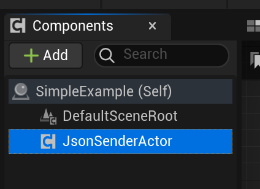


#### 第二，像这样连接节点

这会为委托 OnRequestCompletee 绑定函数。

 


#### 第三，为红色的 "Event" 创建一个自定义事件

 


创建好后，你就可以看到这个节点了， **Content** 变量就是你 PHP 返回的数据。

 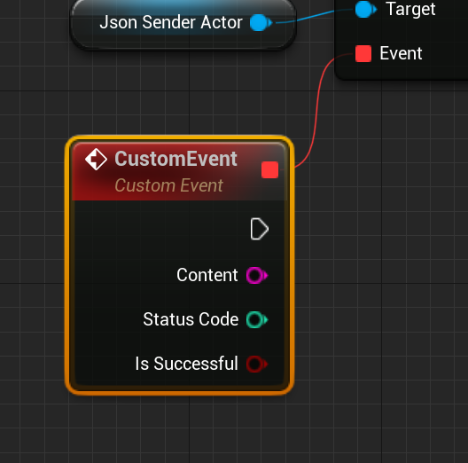


#### 第四，输出 Content

 

​	

#### 第五，向你的 PHP 发送 JSON 数据

我的 php 会返回 mode 这个 Field 的值，你可以在下方找到这个 PHP 代码。

 

```php
<?php
	header("content-type:text/html;charset=utf-8");
	$jsonString = file_get_contents("php://input");
	$jsonObject = json_decode($jsonString);
	echo $jsonObject->mode;
?>
```


#### 第六，把这个 Actor 摆放到关卡里

 


#### 运行查看结果

 


------


## 如何获取 JSON Field 的 Value？

#### 第一，将你的 JSON String 反序列化成 JSON Object

你可以把 JSON String 的基础格式放在你的 PHP 服务器上用以动态更新它们。

 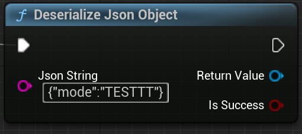


#### 第二，使用 Get Json Value 节点以获取 JSON Object 中的数据

这将会返回一个结构体用以正确获取 Type 枚举指向的类型。

 


#### 第三，使用 Break 节点获取结构体中的数据

 


你会得到这样一个结构体。

 


结构体上的数据与 Get Json Value 节点的 Type 是一一对应的。

 


#### 第四，将 String 打印出来

 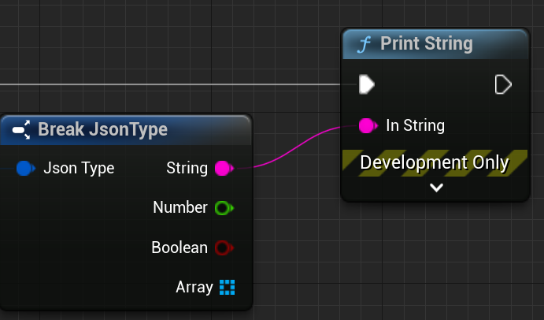


蓝图总览。

 


#### 最终，开始游戏

你可以发现，mode 的 Value 被打印出来了。

 


------


## 如何修改 JSON Field 的 Value？

#### 第一，将你的 JSON String 反序列化成 JSON Object。

 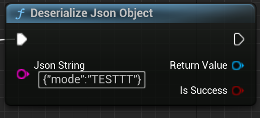


#### 第二，创建 Set Json Value 节点并正确设置

FieldType 变量是这个 Field 的类型，如果类型错误，将会 LOG ERROR。

 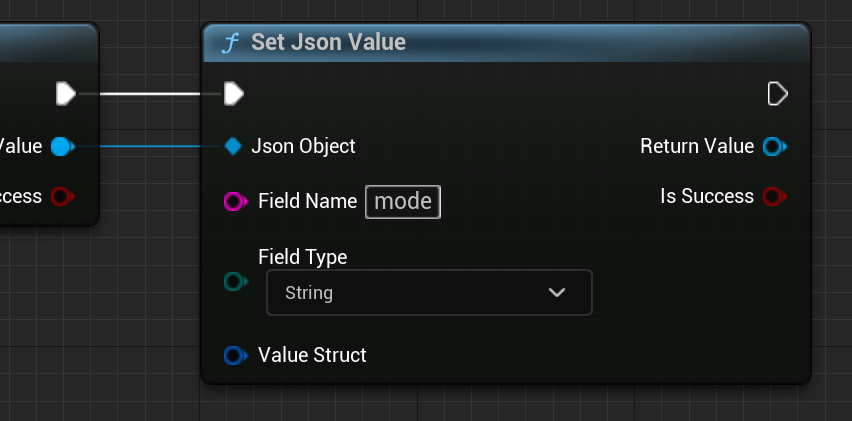


#### 第三，为 ValueStruct 创建结构体

 

 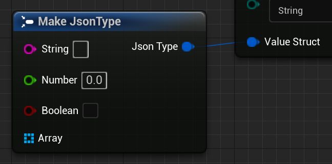


结构体中的数据与 FieldType 是一一对应的，**你不可以为数组 Field 设置其他数组**

 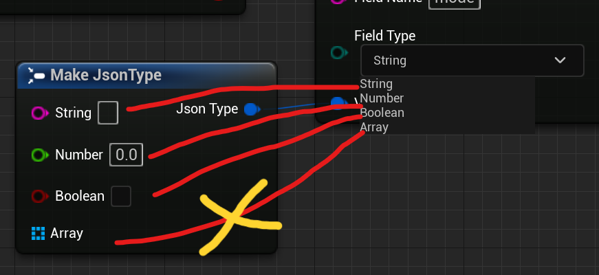


#### 第四，在结构体中输入新的 Value

 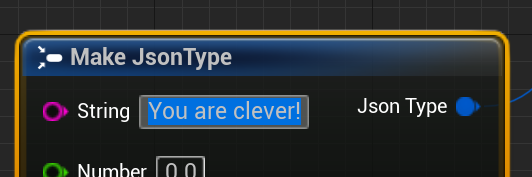


#### 第五，在 SetJsonValue 节点后面添加一个 GetJsonValue 节点

 


#### 第六，像以前那样创建结构体并输出结构体中的 String

 


#### 最终，开始游戏后，就可以看到改变了

**TESTTTT** 被修改成了 **You are clever!**

 


------


## 如何修改数组元素里 Field 的 Value？

#### 第一，编写一个较为复杂的 JSON String

这个 JSON 拥有一个 StudentList 数组和两个元素，***每个元素都可以看作是一个 JSON Object***。

我喜欢使用 **Make Literal String** 节点来整理复杂的 String 数据。

 

```json
{
 "StudentList":
 [
   {
    "Name":"Bob",
    "Age":"18"
   },
   {
    "Name":"Billy",
    "Age":"19"
   }
 ]
}
```


#### 第二，获取数组元素的 Field 并创建结构体

 


#### 第三，获取 Array 中的 JSON Object

 


#### 第四，设置 Name Field 的 Value 为 Lisa

 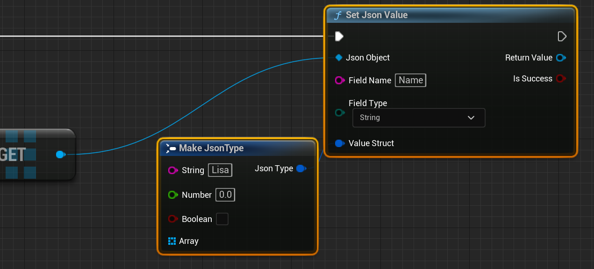

 至此，我们就成功把 Bob 修改为 Lisa 了，接下来我们输出这个名字。


#### 第五，输出 StudentList 数组中第一个 JsonObject 里的 Name Field 的 Value

 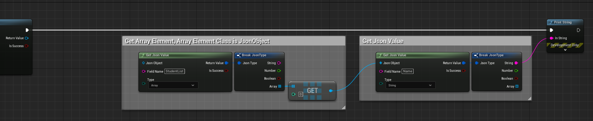


#### 第六，将 JsonObject 与最开始的 JsonObject相连

Set Json Value 节点的返回值仍然是数组的元素，所以我们需要将 JsonObject 连接到最初的 JsonObject Root。


#### 第七，开始游戏

可以看到，JsonObject 中的 Bob 被修改成了 Lisa。

 

